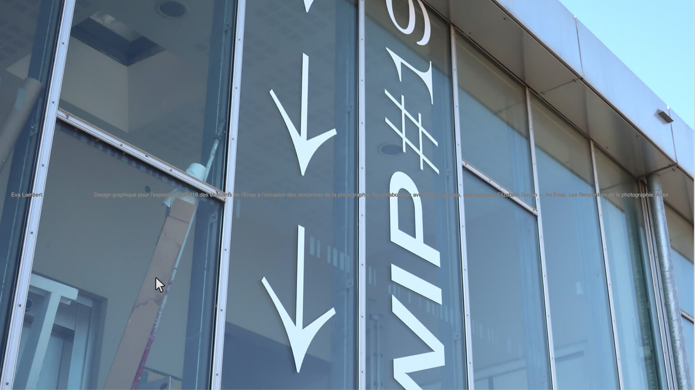
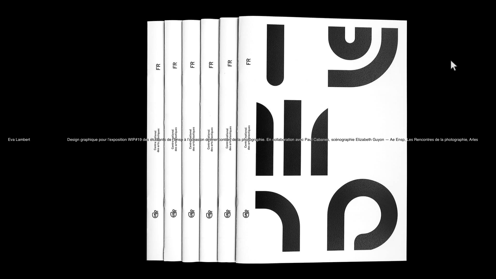
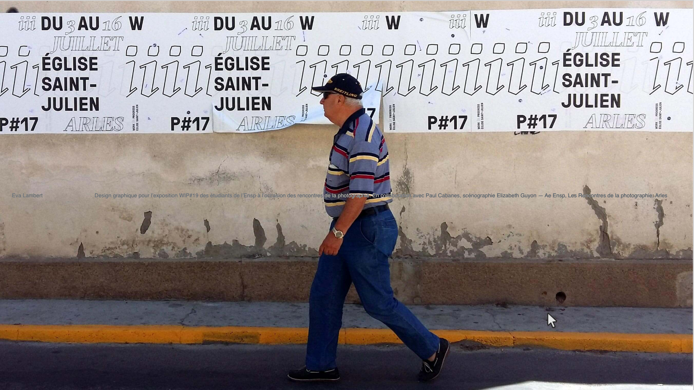
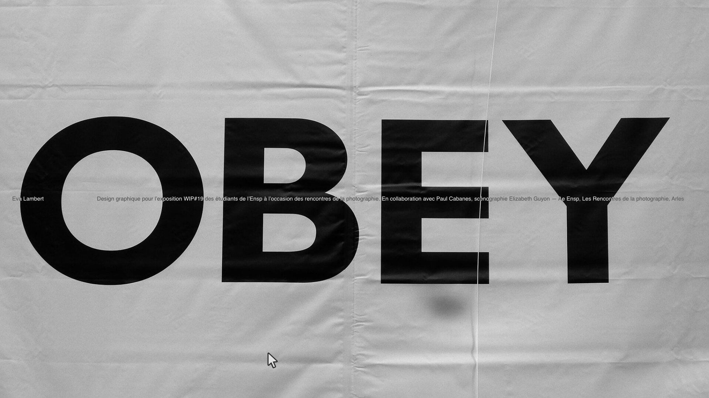
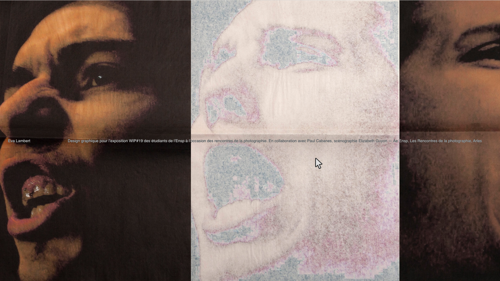
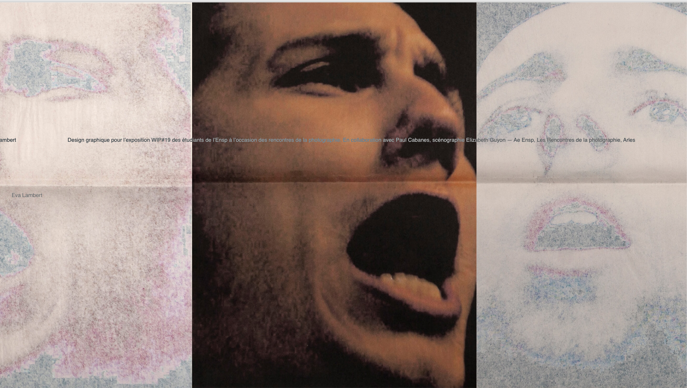

# 💡 IDÉES PORFOLIO

## 📂 STRUCTURE SITE

    - Page d'accueil
        - Projet_1
        - Projet_2
        - Projet_3
        - Projet_…
    - Infos

## 🏠 PAGE D'ACCUEIL

### 🪴 Élements

    - Images projets
    - Mon nomm + descriptif projet

### Comment ça marche

- Une image projet en pleine page
- Mon nom et le descriptif du projet est centré verticalemant sur l'écran et ferré de chaque côté de l'ecran > effet multiple ou différence
- L'image (une image = un projet) change suivant le positionement du curseur dans l'écran
- Le texte descriptif du projet change en fonction de l'image du projet qui apparaît à l'écran
- Au click > Ouvre le projet en question

## 🖼 PAGES PROJETS

### 🎨 Élements

    - Images projets
    - Texte desciptif
    - Crédits

### Comment ça marche

- Une fois entré dans le projet posibilité de scroller verticlament pour accéder à d'autres images du projet + texte desciptif et crédit
- Au click > Retour sur la page d'acceuil

## 👩‍💻 PAGE INFO

### 🏹 Élements

    - Bio
    - Contacts

### Comment ça marche

- Click sur Eva Lambert > Ouvre la page info

## 📸 SCREENSHOT

